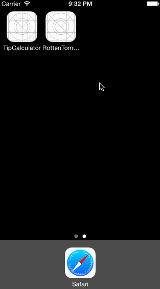

# RottenTomatoes

RottenTomatoes client app for iOS platform.

Time taken : 9 hours

## User stories:

 * [x] Required: User can view a list of movies from Rotten Tomatoes. Poster images are loaded asynchronously.
 * [x] Required: User can view movie details by tapping on a cell
 * [x] Required: User sees loading state while waiting for movies API. Progress indicating animation appears till movie list is loaded.
 * [x] Required: User sees error message when there's a networking error. This is not an UIAlertView.
 * [ ] Required: User can pull to refresh the movie list.
 * [x] Optional: For the large poster, load the low-res image first, switch to high-res when complete
 * [x] Optional: Custom error messages are shown based on the type of the error. 

## Walkthrough of all user stories:

GIF created with [LiceCap](http://www.cockos.com/licecap/).
